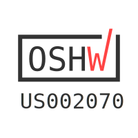

# Hydrogen user guide

[Hydrogen](https://winterbloom.com/shop/hydrogen) is a 1U precision, two channel, 1-to-4 buffered multiple.

[TOC]

## Specifications

* [$69 MSRP](https://winterbloom.com/shop/hydrogen)
* 14 HP
* +12v @ 20mA, -12v @ 20mA
* 22mm deep
* Two channels
* Each channel has four buffered outputs
* Second channel normaled to the first so it can be used as a 1-to-8 buffered multiple.
* [ModularGrid page](https://www.modulargrid.net/e/winterbloom-hydrogen)

## Getting support and help

We want you to have a wonderful experience with your module. If you need help or run into problems, please reach out to us. Email is the best way for product issues, whereas Discord and GitHub are great for getting advice and help on how to customize your module.

* Send us [an email](mailto:support@winterbloom.com)
* File a bug [on GitHub](https://github.com/wntrblm/Castor_and_Pollux/issues)
* Reach out on the [Discord][discord]

## Installing the module

To install this into your Eurorack setup:

1. Connect a Eurorack power cable from your power supply to the back of the module. **Note that even though the power connector on the module is keyed, double check that the red stripe is on the side labeled `red stripe`!**
1. Screw the module to your rack's rails.

## Using the module

Hydrogen has two independent channels with four buffers. Each channel's input is on the left and the four buffered outputs follow on the right. The LEDs in between will glow blue for positive signals, red for negative signals, and purple for audio signals.

{: .dark-invert}

Additionally, if nothing is connected to the second channel's input then the first channel's input is used. This allows you to use Hydrogen as a single channel one-to-eight buffer.

{: .dark-invert}

That's pretty much it! ✨

## Open source hardware & software

Hydrogen is completely open source and hacking is encouraged.

* The [hardware designs](https://github.com/wntrblm/Hydrogen/tree/main/hardware) is available under the permissive [CERN-OHL-P v2](https://cern-ohl.web.cern.ch/) and is designed using [KiCAD](https://kicad.org/) which is free and open-source. You can open the hardware files using KiCAD or you can [check out a PDF of the schematic](https://github.com/wntrblm/Hydrogen/tree/main/hardware/board/board.pdf).

{class=oshw} Hydrogen is [certified open source hardware](TODO)

## Warranty, disclaimers, and limits

Modules purchased from Winterbloom have a warranty of six months from the date of purchase. This warranty covers any manufacturing defects in the module. It does not cover damage from due to incorrect handling, storage, or power, overvoltage events, or modifications.

Please [contact us](mailto:support@winterbloom.com) if you are experiencing issues with your module. Modules returned under warranty will either be refunded, replaced, or repaired at our discretion. You will be responsible for the cost of returning the module to Winterbloom.

Because Eurorack has a vast number of possible combinations of power supplies, modules, cases, and accessories, it is impossible for us to guarantee compatibility with every possible configuration. We make a reasonable effort to test modules with several power supplies, cases, and other modules.

We encourage tinkering, however, we will not refund, repair, or replace any products that have been modified.

We have stress tested Hydrogen under the following conditions. These are provided for reference only; we do not guarantee that that the module will function under these conditions.

* Continuous run time: at least 48 hours
* Overvoltage from power supply: at least `±18 volts`
* Reverse voltage from power supply: at least `±18 volts`
* Undervoltage from power supply: as low as `±6 volts`
* Over and under voltage on inputs: at least `±12 volts`
* Outputs shorted together: at least 30 minutes
* Outputs shorted to ground: at least 30 minutes

## Acknowledgments and thanks

Hydrogen would not be possible without the support of Winterbloom's incredible community, the Trans Synth Discord, and Noise Engineering.

[discord]: https://discord.gg/UpfqghQ
